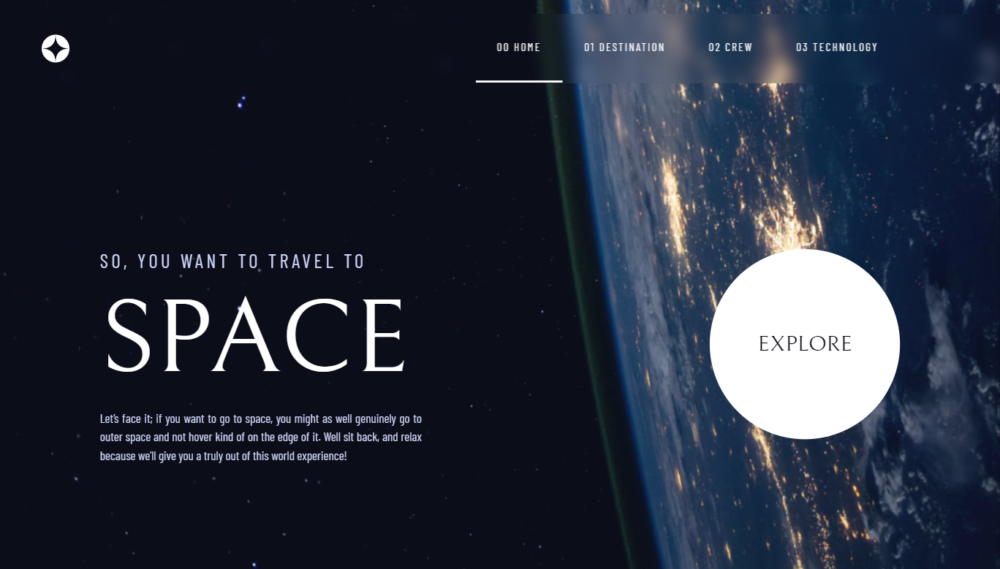

# Frontend Mentor - Space tourism website solution

This is a solution to the [Space tourism website challenge on Frontend Mentor](https://www.frontendmentor.io/challenges/space-tourism-multipage-website-gRWj1URZ3).

## Table of contents

- [Overview](#overview)
  - [The challenge](#the-challenge)
  - [Screenshot](#screenshot)
  - [Links](#links)
- [Author](#author)
- [Acknowledgments](#acknowledgments)

## Overview

### The challenge

Users should be able to:

- View the optimal layout for each of the website's pages depending on their device's screen size
- See hover states for all interactive elements on the page
- View each page and be able to toggle between the tabs to see new information

### Screenshot

### Links

- Solution URL: [Click here](https://www.frontendmentor.io/solutions/space-tourism-multipage-website-1DWxFcFiU)
- Live Site URL: [Click here](https://space-tourism-multi-page-website-one.vercel.app/)

### Useful resources

- [Stackoverflow](https://stackoverflow.com/) - This helped me for many issues I have faced during the development of the project.
- [W3Schools](https://www.w3schools.com/) - Same as **Stackoverflow** , this helped me to understand some fundamental things about CSS and JS.

## Author

- [Web Portfolio](https://www.manueldinisjunior.com)
- [Frontend Mentor](https://www.frontendmentor.io/profile/manueldinisjunior)
- [Git Hub](https://github.com/manueldinisjunior)
- [LinkedIn](https://www.linkedin.com/in/manueldinisjunior)

## Acknowledgments

I want to give thanks specially to [Web Dev Simplified](https://youtu.be/At4B7A4GOPg) YouTube channel for helping me to get some inspiration to develop the navbar of this project.
